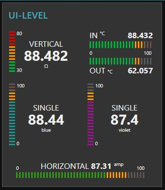

# node-red-contrib-ui-level

 [![NPM version][npm-image]][npm-url]  

[npm-image]: http://img.shields.io/npm/v/node-red-contrib-ui-level.svg
[npm-url]: https://npmjs.org/package/node-red-contrib-ui-level

Adds a linear Level type widget to the user interface

# Requirements

Node-Red v0.20.5 or greater. Node-Red-dashboard v2.15.0 or greater.

# Configuration and behavior

Widget has 3 different layouts: `Single Horizontal`, `Pair Horizontal` and `Single Vertical`.

Widget takes the configured input property and displays it's value at the top of the level graphics. For `Pair Horizontal` layout the input is expected to be an `array`. The value of input is validated to find a numeric value. So you can send number `msg.payload = 15` or string `msg.payload = "15"`

The node's `Label` is displayed near the value. Leave the label field empty to show value only. The Label can be changed on fly by using `msg.control = {label:"New Label"}`. For `Pair Horizontal` layout the `Label` is not displayed but both `Channels` can be labelled independently.

All four colors for stripes can be customized. In addition, there is three options to modify the colors of the level bar. `Multiple segments` - Colors tied to stripes according to sector values. `Single color bar` - Single value-based color for all active stripes. `Interpolated colors` - Colors interpolated from normal to high color. If you choose `Multiple segments` for your stripe colors, you can optionally use the `Peak mode`.

By selecting the `Peak mode`, you can adjust peak hold time (in milliseconds, validated to be in between `800 ... 10000)` or `infinity` to hold peak until node receives `msg.peakreset = true`

The node's `Unit` will be displayed near the current value. Exact position of the unit depends on layout. The unit can be any `string`, for example: `lbs psi F°` Set the unit to empty string if you don't need to display it.

The `min` and `max` values are customizable within the configuration or you can change them on fly by sending new values with `msg.control` property. The `segments` values are also customizable within the configuration and with `msg.control`

You can choose between 3 different stripe resolutions. `Superfine`, `Fine` and `Normal`

You have option to show intermediate `tick values`. By choosing `Segments`, the `tick values` placed at segment positions, with option `Auto`, the tick values will be spread evenly.

You can choose behavior of animations to be `Soft`, `Reactive` or `Rocket` representing speed of animations (800ms, 300ms and 100ms). Animations can be turned off completely. Animation of value text is turned off by default. You can turn it on but be aware, text animation affects performance significantly!

Texts sizes and color in widget can be customized within the configuration only. Color applies for all texts in widget. There is 3 different sizes for text elements in use. Values represent font relative size with unit `"em"`

## Limitations

Widget layout is optimized to look best with default `1x1` unit size `(48px x 48px)`. However, this is not a restriction. Smallest possible `1x1` unit size what is supported by dashboard `(24px x 24px)` is supported by widget also. But you cannot have intermediate tick values together with value field. Playing with text size options you can finetune the layout to fit better into your dashboard design.

## Examples of msg.control usage

`msg.control = {min:10, max:80}` to change min and max values. `msg.control = {min:10, max:80, seg1:30, seg2:60}` to change min, max and segments all together. `msg.control = {seg2:60}` to change high segment value only.

## Performance alert

This widget is not perfect choice to display high-frequent data changes like audio or similar. If you are using a lot of Level widgets on your dashboard and you are feeling performance loss, consider turning off animations of value text (if used) or turn off all animations.

### Licence

This node uses GreenSock animation library GSAP licenced with Standard GreenSock License for non-commercial use https://greensock.com/standard-license/
