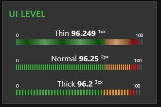

# node-red-contrib-ui-level

[![NPM version][npm-image]][npm-url]

[npm-image]: http://img.shields.io/npm/v/node-red-contrib-ui-level.svg
[npm-url]: https://npmjs.org/package/node-red-contrib-ui-level

Adds a linear Level type widget to the user interface

Since version 0.0.14 the resolution of stripes has 3 options

# Requirements
Node-Red v19.4 or greater
Node-Red-dashboard v2.13.0 or greater
# Configuration and behavior
Widget has 3 different layouts: Single Horizontal, Pair Horizontal and Single Vertical.

Takes the `msg.payload` and displays the value at the top of the level graphics.
For Pair Horizontal layout the `msg.payload` is expected to be an `array`
`msg.payload` is validated to find a nummeric value. So you can send number `msg.payload = 15` or string `msg.payload = "15"` 

The node's `Label` is displayed near the value. Leave the label field empty to show value only.
For Pair Horizontal layout the `Label` is not displayed but both `Channels` can be labelled independently.

The node's `Unit` will be displayed near the current value. Exact position of the unit depends on choosed layout. The unit can be any `string`, for example: `lbs psi F°` Set the unit to empty string if you don't need to display it.

The min and max values are customizable within the configuration but cannot be set with a msg.

The segments's values and colors are also customizable within the configuration but cannot be set with a msg.    

You can choose anmations to be `soft` or `reactive` or animations can be turned `off` completely.

You can choose between 3 different stripe resolutions. Superfine, Fine and Normal

## Performance alert

This widget is not perfect choice to display high-frequent data changes like audio or similar.  
If you are using a lot of Level widgets on your dashboard and you are feeling performance loss, considere lower resolution for stripes and/or turning off the animations.